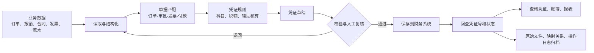
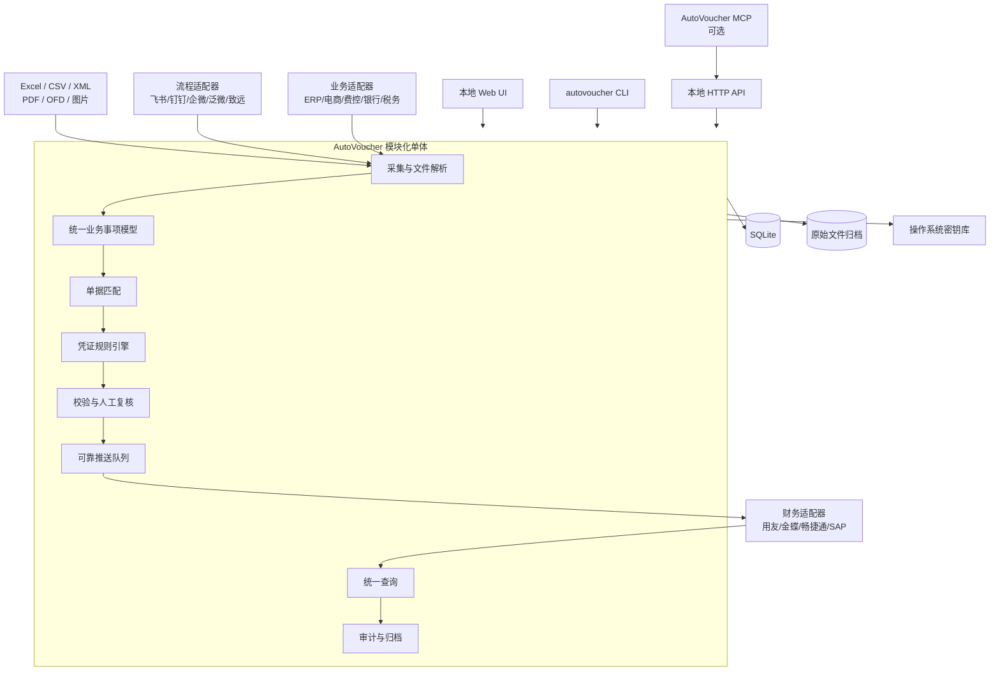
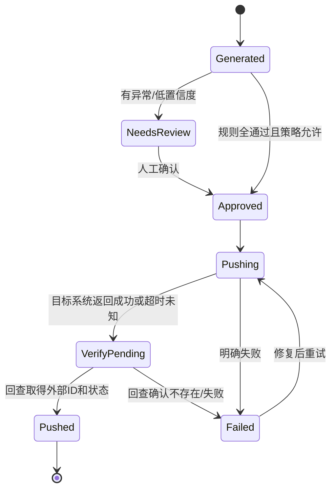

# 凭证自动化本地化程序：调研与实现方案

> 调研日期：2026-07-24
> 定位：本地优先、可审核、可追溯、可按企业现有系统逐步接入
> 目标用户：需要汇总业务数据、生成凭证、推送财务系统并查询凭证/账簿/报表的中国企业

## 1. 结论先行

最简单、最稳妥的实现不是先做一个“大而全的财务中台”，而是做一个本地运行的模块化单体程序：

1. 第一层永远支持 Excel、CSV、XML、PDF、OFD、图片和文件夹导入，不依赖任何第三方接口。
2. 第二层通过适配器选接飞书、钉钉、企业微信、泛微、致远、ERP、电商平台、银行和税务数据。
3. 所有来源先转换为统一的“业务事项”和“凭证草稿”模型，生成逻辑不直接依赖某一家财务软件。
4. 规则负责金额、科目、辅助核算和校验；AI 只负责提取、归类建议和异常说明，不直接决定入账。
5. 默认只向财务系统“保存凭证草稿”。提交、审核、过账是三个独立能力，必须单独授权和配置。
6. 每次推送后都要从目标系统回查，只有取得外部凭证 ID、凭证号和状态才算成功。
7. 本地程序同时提供图形界面、HTTP API 和 CLI；MCP 是外层工具接口，不作为内部核心架构。

这条路线能先在没有任何厂商 API 权限时跑通完整演示，也能在取得企业授权后逐个替换为自动同步。

## 2. 要解决的真实流程



程序需要支持五个业务闭环：

- 采集：上传文件、监听文件夹、拉取 API、接收 Webhook。
- 生成：把业务事项转换为借贷平衡的凭证草稿。
- 审核：展示来源、匹配证据、规则命中过程和异常，让会计确认。
- 推送：保存、提交或审核目标财务系统中的凭证，并处理重复、失败和重试。
- 查询：统一查询本地草稿、目标系统凭证、科目余额、明细账和财务报表。

## 3. 中国境内系统接口调研

### 3.1 调研口径

下表中的“有 API”不等于开箱即用。实际接入通常还需要：

- 企业管理员创建自建应用并授权；
- 指定应用可见范围、操作用户、账套和组织；
- 申请敏感权限、配置回调地址或 IP 白名单；
- 购买对应开放平台、集成许可或厂商实施服务；
- 确认具体产品、版本、补丁和私有化/公有云部署方式；
- 使用客户测试账套验证字段、状态机和限流。

同一厂商不同产品线的接口不能混用。例如用友 U8、U8 Cloud、NC Cloud、YonSuite、YonBIP 是不同适配器；金蝶 K3 Cloud、EAS、星辰、苍穹也不能视为同一个 API。

### 3.2 流程与 OA 系统

| 系统 | 可用接口 | CLI / MCP | 对凭证自动化的价值 | 主要限制 |
|---|---|---|---|---|
| 飞书审批 | 官方服务端 API 可创建审批实例、批量取实例 ID、取详情、撤回、订阅事件 | 飞书已有官方 CLI 和官方 OpenAPI MCP；MCP 仍标注 Beta，默认工具集有限，文件上传/下载目前不支持 | 读取报销、付款、采购等已审批单据；回写凭证号；发起补充审批 | 需要企业应用、权限审核、租户令牌；审批表单字段按控件 ID 映射 |
| 钉钉 OA 审批 | 官方 API 可发起、查询、撤销审批并接收事件 | DingTalk Workspace CLI 已公开，支持审批命令并通过 MCP/原始 OpenAPI 调用 | 读取费用、合同、付款审批；用审批通过作为入账门槛 | 需要应用授权、模板 processCode、用户身份和可见范围 |
| 企业微信审批 | 官方 API 可取模板、提交审批、批量取审批编号、取详情和接收状态回调 | 未查到覆盖审批的通用官方 CLI/MCP 产品，建议直接调用 API | 适合从企业微信报销/付款审批生成凭证 | 应用 Secret、可见范围和审批数据权限严格；附件数量及临时素材有约束 |
| 泛微 e-cology | e-cology E9 提供 REST 接口、Token 认证、流程/表单等 API 和 Java 二开能力 | 未查到通用官方 CLI/MCP | 适合大型企业私有化 OA 的流程和表单读取 | 常见为项目制接入；需许可证、白名单、IP、产品补丁，接口随版本和二开变化 |
| 致远 V5/CAP/CIP | 官方开放平台提供 RESTful API、本地 API、JavaDoc、BPM 和数据交换能力 | 未查到通用官方 CLI/MCP | 可读取流程、表单和组织数据，并与 NC/EAS/SAP/U8 等集成 | 多为客户项目环境；需核对版本、CIP/DEE 授权和具体流程接口 |

核对依据：

- [飞书创建审批实例](https://open.feishu.cn/document/server-docs/approval-v4/instance/create)
- [飞书 API 权限申请机制](https://open.feishu.cn/document/ukTMukTMukTM/ukDNz4SO0MjL5QzM/apply-for-api-permission-token-agnostic)
- [飞书官方 OpenAPI MCP](https://github.com/larksuite/lark-openapi-mcp)
- [飞书官方 CLI](https://github.com/larksuite/cli)
- [钉钉发起审批实例](https://open.dingtalk.com/document/development/oa-approval-initiates-approval-instances)
- [DingTalk Workspace CLI](https://github.com/DingTalk-Real-AI/dingtalk-workspace-cli)
- [企业微信提交审批申请](https://open.work.weixin.qq.com/api/doc/90000/90135/91853)
- [泛微 E9 后端接口文档](https://e-cloudstore.com/ec/api/index.html)
- [致远开放平台](https://open.seeyon.com/)

#### 流程系统接入建议

流程系统只负责提供“业务已被批准”的证据，不负责决定会计科目。建议保留：

- 审批实例 ID、模板 ID、审批单号；
- 发起人、部门、法人主体、成本中心；
- 审批完成时间、最终状态、审批节点摘要；
- 表单原始 JSON 和附件 ID；
- 拉取时间和源系统版本。

只有状态明确为“审批通过”的业务事项才能进入自动推送队列。审批中、撤回、拒绝或状态不明的事项只生成待处理任务。

### 3.3 业务系统、发票和银行

业务系统范围很大，建议按“数据取得难度”而不是按行业逐个硬编码。

| 来源 | 常见接口情况 | 推荐首版接法 | 后续自动化 |
|---|---|---|---|
| ERP 采购/销售/库存 | 金蝶、用友、SAP 等通常有 OpenAPI、WebAPI、OData 或项目接口 | Excel/CSV 导出；复用财务适配器的查询能力 | 按更新时间增量拉订单、收货、发票、收付款 |
| 电商平台 | 淘宝/天猫、京东、拼多多等有商家开放平台 API | 平台账单和订单文件 | 企业/服务商应用授权后按订单和账单 API 拉取 |
| 费控/商旅 | 厂商通常有企业或合作伙伴 API，但公开程度不一 | 报销单、行程单、结算单文件 | 与客户已有费控/商旅合同一起申请接口 |
| 发票 | 不应假设存在一个对所有企业开放、无需授权的全国发票 API | 优先读取数电发票 XML/OFD/PDF 原文件 | 接企业已有税务平台、票夹或服务商接口 |
| 银行流水/回单 | 各银行银企直联或开放银行接口，通常需要签约、证书、专线/公网和 IP 白名单 | 银行导出的 CSV/XLSX、电子回单、对账单 | 逐银行签约银企直联，或接企业已有资金平台 |
| 纸质/PDF/图片 | 无结构化 API | 本地 OCR + 人工确认 | 只把 OCR 作为提取工具，不把识别结果视为原始凭证 |

中国目前已经发布电子凭证会计数据标准推广应用版，覆盖数电发票、财政电子票据、银行电子回单、银行电子对账单等。标准支持 XML、内嵌 XBRL 的 OFD、内嵌 XML/XBRL 的 PDF 等格式。因此，程序应优先解析原始结构化文件，不应先 OCR 再丢失电子签名和元数据。

银行方面没有一个可以替代所有银行的统一公众接口。民生银行、建设银行、国家开发银行等公开说明均显示，银企直联可以提供账户查询、交易、回单、对账和支付等能力，但企业需要签约和配置。首版把“银行文件导入”做好，比先适配十家银行更现实。

核对依据：

- [财政部：电子凭证会计数据标准（推广应用版）](https://kjs.mof.gov.cn/zt/kuaijixinxihuajianshe/dzpzkjsjbzshsd/sjbz/202505/t20250519_3964020.htm)
- [财政部：推广应用电子凭证会计数据标准](https://www.mof.gov.cn/jrttts/202505/t20250521_3964264.htm)
- [民生银行银企直联](https://www.cmbc.com.cn/gsjr/xjgl/qdfwl/yqzl/index.htm)
- [建设银行传统直联](https://company2.ccb.com/chn/2024-10/18/article_2024101823340016547.shtml)
- [建设银行银企直联文档下载](https://company2.ccb.com/chn/wyzl/xzzx/index.shtml)
- [宁波银行开放平台](https://openapi.nbcb.com.cn/)

### 3.4 财务和账务系统

| 系统 | 生成/推送凭证 | 查询凭证/账簿/报表 | SDK / CLI / MCP | 适配建议 |
|---|---|---|---|---|
| 用友 U8 OpenAPI | 官方接口目录明确提供新增凭证、凭证作废 | 提供凭证列表/详情、科目总账、辅助总账、期间和结账状态 | 有官方 Java/C# SDK；未查到面向 U8 总账的官方通用 CLI/MCP | 很适合作为首个标准适配器；接口边界清晰 |
| 用友 YonSuite / YonBIP / NC / U8 Cloud | 有开放平台和大量业务 API，但具体财务凭证接口按产品、租户和服务授权而定 | 一般具备财务和报表服务，需在客户开发者中心确认 API | SDK/API 为主；未查到统一覆盖全部产品的财务 CLI/MCP | 每条产品线单独做能力探测和适配 |
| 金蝶云·星空 K3 Cloud | WebAPI/OpenAPI SDK 支持第三方系统授权；动态单据服务可保存、提交、审核，凭证对象需按版本联调 | 可查询凭证；通用单据查询和报表能力需按表单/对象配置 | 有 Java、C#、Python 等 SDK；未查到总账专用官方 CLI/MCP | 作为第二个重点适配器；先只开保存，后开提交/审核 |
| 畅捷通 T+ / 好会计 | 官方开放平台明确提供 API，并有“凭证通”类 OA 到财务场景 | 产品和版本不同，查询范围需在开放平台逐项核对 | OpenAPI 为主；未查到总账专用官方 CLI/MCP | 适合小微企业版本，但先用客户测试账套验证 |
| SAP S/4HANA | 官方 Journal Entry API/自动化内容可批量创建会计分录 | OData/CDS/API 可查询总账行项目和分析数据 | SAP CLI 不是本项目的主要接法；无必要以 MCP 为主 | 仅在目标客户已使用 SAP 时开发，接入成本高于国产中小企业软件 |

核对依据：

- [用友 U8 API 中心](https://open.yonyouup.com/apiCenter/index)
- [用友开发者中心 OpenAPI](https://developer.yonyou.com/openAPI)
- [金蝶云·星空 OpenAPI SDK](https://open.kingdee.com/K3Cloud/Open/ApiCenterReportDetail.aspx)
- [金蝶云·星空凭证录入](https://open.kingdee.com/k3cloud/help/GL_VOUCHER.html)
- [金蝶云·星空凭证查询](https://open.kingdee.com/K3Cloud/help/GL_352.html)
- [畅捷通开放平台](https://open.chanjet.com/)
- [SAP Business Accelerator Hub](https://api.sap.com/)

#### 关于 MCP 的实际判断

截至调研日：

- 飞书已有官方通用 OpenAPI MCP，适合作为飞书能力的可选调用入口，但仍是 Beta，且文件上传/下载缺失。
- 钉钉已有面向工作空间的 CLI/MCP 项目，并覆盖审批；仍应把钉钉 OpenAPI 当成稳定契约，把 CLI/MCP 当作调用便利层。
- 主流财务系统的可靠接入方式仍然是官方 API/SDK。没有证据表明金蝶、用友、畅捷通的总账接口已经由统一、成熟、官方 MCP 完整覆盖。
- 不建议依赖未知来源的社区 MCP 直接执行凭证保存、审核或过账。可以在本程序内部实现自己的 MCP，并让它调用已经过测试的财务适配器。

## 4. 推荐产品形态

### 4.1 用户看到的界面

首版只需要六个页面：

1. **工作台**：待导入、待匹配、待审核、推送失败、今日已完成。
2. **导入数据**：拖入文件/文件夹，或选择已配置的数据源同步。
3. **凭证草稿**：左右对照原始单据与借贷分录，显示规则和证据。
4. **异常中心**：重复票据、金额不一致、科目不确定、缺辅助核算、期间关闭等。
5. **推送记录**：本地草稿 ID、目标系统 ID、凭证号、状态、错误和重试。
6. **查询中心**：凭证、总账、明细账、科目余额表、资产负债表、利润表、现金流量表。

用户的默认操作路径：

```text
拖入文件
→ 查看系统自动匹配结果
→ 处理少量异常
→ 批量确认凭证草稿
→ 推送到测试账套/正式账套
→ 自动回查凭证号
```

### 4.2 部署方式

推荐首版采用“本地 Web 应用”：

- 用户双击启动一个本地程序；
- 程序监听 `127.0.0.1`，自动打开浏览器；
- 数据库、文件和日志都在用户指定的数据目录；
- 默认不对局域网或互联网开放；
- Windows 通过 Docker Desktop 交付，macOS/Linux 保留本地开发方式；
- 企业需要多人使用时，再把同一程序部署到内网服务器并切换 PostgreSQL。

这比一开始开发原生 Windows 客户端、移动端和云端多租户系统简单，并将 Windows 运行环境统一在 Docker 中。

## 5. 高层架构



### 5.1 为什么选择模块化单体

- 首版是单机或单企业内网工具，微服务只会增加部署和排错成本。
- 财务事务、审计日志、推送状态需要强一致，本地数据库更容易保证。
- 每个外部系统仍然是独立适配器，未来可以按需拆出同步服务。
- 失败重试使用数据库 Outbox，不必在首版引入 Kafka、RabbitMQ 或 Redis。

### 5.2 建议技术栈

首版：

| 层 | 建议 | 原因 |
|---|---|---|
| 语言 | Python 3.12+ | Excel、PDF、OCR、会计数据处理和 API SDK 生态最方便 |
| UI | NiceGUI 或 FastAPI + 轻量前端 | NiceGUI 最快交付；需要更复杂交互时再换独立前端 |
| API | FastAPI + Pydantic | 自动校验、OpenAPI 文档、便于后续 CLI/MCP |
| 数据库 | SQLite + SQLAlchemy/Alembic | 单机零运维、事务可靠、可备份；多人版再迁 PostgreSQL |
| 文件解析 | openpyxl、polars、lxml、pypdf；OFD 使用独立解析器 | 结构化解析优先 |
| OCR | PaddleOCR，可选本地模型 | 中文票据本地识别；仅处理无结构化数据的图片 |
| 调度 | APScheduler + 数据库任务表 | 足够支持本地定时同步 |
| HTTP | httpx | 统一超时、重试、证书和代理配置 |
| 密钥 | Windows Credential Manager / macOS Keychain / Linux Secret Service | 不把 AppSecret、证书密码写入 SQLite 或配置文件 |
| Windows 交付 | Docker Desktop 预构建镜像 + Compose | 面向非开发者一键启动，统一运行环境 |

若团队已经有成熟的 React/Tauri 能力，可以用 Tauri 做外壳，但不建议为了“桌面感”增加首版复杂度。

## 6. 统一数据模型

### 6.1 原始资料

```yaml
SourceDocument:
  id: 本地UUID
  source_system: feishu | dingtalk | wecom | file | bank | tax | erp
  source_type: approval | invoice | bank_transaction | order | receipt | contract
  external_id: 源系统唯一ID
  content_sha256: 原文件哈希
  occurred_at: 业务发生时间
  legal_entity: 法人主体
  raw_payload: 原始JSON/XML元数据
  archive_path: 本地只读归档路径
  signature_status: valid | invalid | not_checked | not_applicable
  imported_at: 导入时间
```

必须用“来源系统 + 外部 ID”和“文件哈希”双重去重。文件名、发票号码或金额都不能单独作为唯一依据。

### 6.2 业务事项

```yaml
BusinessEvent:
  id: 本地UUID
  event_type: expense | purchase | sale | collection | payment | payroll | transfer
  company_code: 核算主体
  business_date: 业务日期
  counterparty: 客商
  currency: CNY
  gross_amount: 含税金额
  net_amount: 不含税金额
  tax_amount: 税额
  department: 部门
  cost_center: 成本中心
  project: 项目
  employee: 员工
  source_document_ids: 关联原始资料
  approval_status: approved | pending | rejected | unknown
  match_confidence: 0到1
  exceptions: 异常列表
```

### 6.3 凭证草稿

```yaml
VoucherDraft:
  id: 本地UUID
  company_code: 核算主体
  ledger_code: 账簿
  accounting_date: 凭证日期
  period: 会计期间
  voucher_type: 凭证字/类别
  summary: 摘要
  source_event_ids: 业务事项
  status: generated | needs_review | approved | pushing | pushed | failed
  rule_version: 规则版本
  lines:
    - line_no: 1
      account_code: 科目编码
      debit: 100.00
      credit: 0
      currency: CNY
      dimensions:
        department: D001
        cost_center: C001
        project: P001
        customer: null
        supplier: S001
      explanation: 命中的规则和依据
  validation_results: 校验结果
```

金额使用 Decimal，数据库中使用定点数或最小货币单位，禁止使用二进制浮点数。

### 6.4 外部引用和推送状态

```yaml
ExternalReference:
  local_voucher_id: 本地凭证ID
  target_system: yonyou_u8
  target_tenant: 客户/租户
  target_ledger: 账套/账簿
  external_voucher_id: 外部内码
  external_voucher_no: 凭证号
  external_status: saved | submitted | approved | posted | voided
  idempotency_key: 防重复键
  last_verified_at: 最后回查时间
```

## 7. 规则和 AI 的职责边界

### 7.1 必须由确定性规则完成

- 借贷平衡；
- 税额、含税/不含税金额换算；
- 科目编码和辅助核算是否存在；
- 币种、本位币、汇率和数量金额校验；
- 会计期间是否开放；
- 法人主体、账簿和凭证字映射；
- 发票、回单和业务事项重复检测；
- 审批是否完成；
- 推送幂等和状态机；
- 目标系统错误码处理。

### 7.2 AI 可以协助

- 从非结构化 PDF/图片中提取候选字段；
- 根据摘要和历史规则推荐科目；
- 推荐部门、项目或成本中心；
- 解释单据之间金额或日期不一致的原因；
- 给会计生成简洁的待确认问题。

### 7.3 AI 不应直接完成

- 无证据地补齐金额、税号、银行账号或科目；
- 绕过审批状态；
- 直接审核或过账；
- 修改已经回查确认的外部凭证；
- 把低置信度结果伪装成确定结果。

科目推荐可以使用如下顺序：

```text
企业明确规则
> 历史已确认映射
> 供应商/客户默认规则
> 关键词和税收分类规则
> AI 推荐
> 人工选择
```

任何人工修改都可以选择“仅本次使用”或“保存为新规则”，防止一次例外污染长期规则。

## 8. 适配器契约

每个连接器必须先报告能力，程序不能假设所有系统都支持同样操作。

```python
class ConnectorCapabilities:
    can_pull_documents: bool
    can_receive_webhooks: bool
    can_save_voucher_draft: bool
    can_submit_voucher: bool
    can_approve_voucher: bool
    can_post_voucher: bool
    can_query_vouchers: bool
    can_query_ledger: bool
    can_query_reports: bool
    supports_attachments: bool

class FinanceConnector:
    def test_connection(self): ...
    def get_capabilities(self): ...
    def get_master_data(self, changed_since=None): ...
    def validate_voucher(self, draft): ...
    def save_voucher(self, draft, idempotency_key): ...
    def submit_voucher(self, external_id): ...
    def query_voucher(self, external_id): ...
    def query_ledger(self, query): ...
    def query_report(self, query): ...
```

### 8.1 推送状态机



“请求超时”不能直接标记失败并重发，因为目标系统可能已经保存成功。正确做法是先用幂等键、来源单号或业务唯一字段回查，再决定是否重试。

### 8.2 禁止直接写目标数据库

即使客户提供数据库账号，也不应通过直接 INSERT/UPDATE 创建凭证。这样会绕过产品业务规则、权限、日志、期间控制和关联表，极易产生不可恢复的数据。只使用厂商 API、导入模板或经过厂商确认的集成服务。

## 9. 程序自身的 API、CLI 和 MCP

### 9.1 HTTP API

建议提供：

```text
POST /api/v1/imports/files
POST /api/v1/connectors/{id}/sync
POST /api/v1/voucher-drafts/generate
GET  /api/v1/voucher-drafts
GET  /api/v1/voucher-drafts/{id}
POST /api/v1/voucher-drafts/{id}/approve
POST /api/v1/voucher-drafts/{id}/push
GET  /api/v1/vouchers
GET  /api/v1/ledgers
GET  /api/v1/reports
GET  /api/v1/jobs/{id}
```

所有变更接口都接受 `Idempotency-Key`，并记录操作者、请求摘要、规则版本、前后状态和外部响应摘要。

### 9.2 CLI

```bash
autovoucher import ./2026-06/
autovoucher generate --company 1001 --period 2026-06
autovoucher list exceptions
autovoucher approve --id VD-202606-001
autovoucher push --id VD-202606-001 --target u8-test
autovoucher sync --connector feishu
autovoucher query voucher --no 记-0001
autovoucher query ledger --account 6602 --period 2026-06
autovoucher query report --type balance-sheet --period 2026-06
```

CLI 适合批处理、计划任务和调试，也比让自动化工具直接操作数据库安全。

### 9.3 MCP

程序可以提供自己的 MCP Server，将稳定的本地 API 映射为工具：

- `import_documents`
- `generate_voucher_drafts`
- `list_review_tasks`
- `get_voucher_draft`
- `explain_voucher_draft`
- `approve_voucher_draft`
- `push_approved_voucher`
- `query_vouchers`
- `query_ledger`
- `query_financial_report`

安全默认值：

- 查询类工具可直接调用；
- 导入、生成草稿属于可撤销操作；
- 审核、推送属于重要操作，需要用户明确确认；
- 不向 MCP 暴露“自动过账”；
- MCP 只能调用本地 API，不能读取密钥或目标数据库。

## 10. 校验与异常清单

### 10.1 导入校验

- 文件类型和实际 MIME 是否一致；
- 原文件哈希是否已存在；
- XML/OFD/PDF 中的签名和结构化数据能否验证；
- 业务主体、税号、币种、日期是否可识别；
- 来源记录是否已被撤回或更新；
- 同一发票号+销售方税号是否重复；
- 同一银行流水号是否重复。

### 10.2 匹配校验

- 订单、入库、发票、审批、付款的金额是否一致；
- 含税、不含税和税额是否勾稽；
- 付款对象和发票销售方是否一致；
- 付款日期是否早于审批或业务发生日期；
- 一张发票是否被多个报销单使用；
- 一笔流水是否被多个业务事项占用；
- 拆单、合单和部分付款是否有明确关系。

### 10.3 凭证校验

- 借方合计等于贷方合计；
- 每行只能有借方或贷方；
- 科目、客商、部门、项目、成本中心存在且有效；
- 需要辅助核算的科目已经填写完整；
- 账簿、期间和凭证字有效；
- 已结账期间不可写入；
- 外币、汇率和本位币金额一致；
- 摘要、附件和来源引用完整；
- 同一业务事项没有生成并推送过有效凭证。

### 10.4 推送校验

- 连接目标明确标识为测试或生产；
- 操作用户具有最小权限；
- 本地草稿已经审核；
- 推送前重新取主数据和期间状态；
- 保存后回查外部 ID、凭证号、金额、行数和状态；
- 回查结果与本地草稿不一致时立即进入异常中心。

## 11. 本地化、安全与合规

这不是法律意见，但产品设计至少要满足以下工程要求：

1. 原始电子凭证、结构化数据和元数据一起保存，不能只留截图或 OCR 文本。
2. 建立原始资料、业务事项、凭证和外部凭证号之间的双向检索关系。
3. 保存经办、审核、审批等必要的审签记录。
4. 原始文件进入归档区后不可静默覆盖；更新形成新版本。
5. 采用哈希、只追加审计日志、备份和恢复测试，帮助发现篡改。
6. 个人信息和财务数据默认本地处理；若调用云端模型，必须明确显示将发送的字段并支持脱敏。
7. AppSecret、Access Token、银行证书和密码存入操作系统密钥库。
8. 程序默认仅监听本机；内网部署才启用用户登录、RBAC、TLS 和访问日志。
9. 提供完整导出和备份，不把客户数据锁死在软件内部。
10. 删除资料必须遵循企业档案制度，不能提供无审计的批量永久删除。

财政部 2024 年发布的《会计信息化工作规范》和《会计软件基本功能和服务规范》要求会计信息系统处理电子原始凭证及元数据、防止重复入账，并具备相应的会计资料生成与服务能力。《会计档案管理办法》要求真实、完整、可用、安全，支持输出、审签、防篡改、备份以及元数据移交。

核对依据：

- [会计信息化工作规范](https://kjs.mof.gov.cn/zhengcefabu/202408/P020240805628932632907.pdf)
- [会计软件基本功能和服务规范](https://www.mof.gov.cn/jrttts/202408/t20240809_3941453.htm)
- [会计档案管理办法](https://www.mof.gov.cn/zcsjtsgb/gztsgb/201512/t20151211_3578376.htm)
- [电子档案管理办法](https://www.saac.gov.cn/daj/xzfgk/202412/41b270e9dfc44f48a09adcc5f4fe8296.shtml)
- [国家网信办法律目录](https://www.cac.gov.cn/wxzw/zcfg/fl/A09370301index_1.htm)

## 12. 非功能要求

首版不需要为互联网大规模并发设计，但财务正确性要求高于吞吐量。

| 类别 | 首版目标 |
|---|---|
| 数据正确性 | 金额使用 Decimal；所有推送必须回查；禁止静默丢记录 |
| 性能 | 10,000 行 Excel 在普通办公电脑上可交互处理；长任务异步显示进度 |
| 可用性 | 单机断网仍可导入、生成和审核；联网恢复后继续同步 |
| 恢复 | 自动每日备份；支持用户手工导出完整备份；定期做恢复验证 |
| 安全 | 本机默认、最小权限、密钥进系统密钥库、敏感字段日志脱敏 |
| 可审计 | 原始资料、规则版本、人工修改、推送请求和回查结果可追溯 |
| 可维护 | 厂商适配器独立；核心模型不依赖厂商字段 |
| 可移植 | Windows 优先，同时支持 macOS；多人版可迁内网 Linux/PostgreSQL |

## 13. 关键架构决策

### ADR-001：采用本地优先的模块化单体

**状态：建议采纳**

**决定**：首版使用一个应用进程、一个 SQLite 数据库和一个本地文件库。

**替代方案**：

- 微服务：扩展性好，但部署、消息一致性和排错成本不适合首版。
- 纯云 SaaS：便于集中升级，但增加财务数据出境/上云顾虑和多租户安全成本。
- 纯桌面原生：体验好，但跨平台 UI 和后台任务开发成本更高。

**后果**：最快形成可运行产品；多人和大规模任务出现后再迁 PostgreSQL 或拆同步进程。

### ADR-002：核心使用统一模型，厂商字段只留在适配器

**状态：建议采纳**

**决定**：所有输入先转换为 `SourceDocument` 和 `BusinessEvent`，所有财务系统接收统一 `VoucherDraft`。

**替代方案**：直接把飞书字段映射到用友/金蝶字段。首个场景更快，但第二个流程或第二个财务系统会复制全部逻辑。

**后果**：初期要定义统一模型，但新增来源和目标系统时只写新适配器。

### ADR-003：默认保存草稿，不自动审核或过账

**状态：建议采纳**

**决定**：生产环境默认最高权限为“保存凭证草稿”。提交、审核和过账分别启用，且需要更高权限。

**原因**：财务系统自身也强调过账前人工检查；过账后通常只能冲销或补充，错误代价高。

**后果**：首版不能宣传“完全无人记账”，但能提供真实、可控的自动化。

### ADR-004：规则优先，AI 只提供建议

**状态：建议采纳**

**决定**：会计金额、平衡、期间、主数据和推送状态全部由确定性代码验证。AI 输出必须附置信度和依据。

**后果**：产品可能少一些“全自动”观感，但结果可测试、可解释、可复核。

### ADR-005：自建 HTTP API、CLI 和 MCP

**状态：建议采纳**

**决定**：内部只依赖本程序的 Python 接口；HTTP API 是稳定边界；CLI/MCP 都是 API 客户端。

**后果**：即使某家厂商没有 MCP，也能通过已经验证的适配器对 Agent 暴露安全工具。

## 14. 最小可行版本

### M0：本地闭环，不接任何外部 API

必须完成：

- Excel/CSV、数电发票 XML、普通 PDF/图片导入；
- 文件哈希去重和原件归档；
- 一种常见流程：费用报销或采购付款；
- 订单/报销单、发票、银行流水匹配；
- CSV/YAML 科目和辅助核算规则；
- 凭证草稿、异常中心和人工确认；
- 导出用友/金蝶/畅捷通中的一种官方导入模板或通用凭证 Excel；
- 本地凭证和处理日志查询；
- 空白生产配置、明确的待配置事项和用户自行导入的测试账套资料；不内置示例公司或虚构业务数据。

M0 已能证明产品核心价值，也不会被第三方账号和审批权限阻塞。

### M1：一个流程系统 + 一个财务系统

推荐组合二选一：

- 飞书审批 + 用友 U8；
- 钉钉审批 + 金蝶云·星空。

必须完成：

- 增量拉取审批通过的单据；
- 拉取/缓存目标系统科目、客商、部门、项目、期间；
- 保存凭证草稿；
- 保存后回查凭证 ID、编号和状态；
- 断网、超时、重复推送和部分失败测试；
- 测试账套/生产账套醒目标识；
- 完整审计日志。

### M2：查询和更多数据源

- 凭证、科目总账、辅助总账和报表统一查询；
- 银行电子回单/对账单结构化解析；
- OFD 和 XBRL 元数据处理；
- 文件夹监听和定时同步；
- 第二家流程系统或第二家财务系统适配器。

### M3：企业级能力

- 内网多人部署、SSO、RBAC；
- 双人复核、职责分离；
- 高可用数据库和集中备份；
- 银企直联、税务/票夹、费控和商旅接口；
- 电子档案移交包；
- 国产数据库、操作系统和国密要求的专项适配。

## 15. 首个演示场景

建议用虚构小公司的“采购付款”：

输入：

- 采购审批单；
- 采购订单；
- 收货单；
- 数电发票；
- 银行付款流水；
- 科目和供应商映射表。

自动处理：

1. 按订单号、供应商、金额和日期匹配资料；
2. 识别一张重复发票；
3. 识别一笔付款与审批金额不一致；
4. 对完全匹配的业务生成凭证草稿；
5. 对异常业务提出具体问题；
6. 会计确认后导出或推送测试账套；
7. 回查并显示财务系统凭证号。

这个演示比“上传一张发票就自动记账”更可信，因为它展示了真实的资料关联、异常处理和人工控制。

## 16. 开发前必须向首个客户确认

开始写真实适配器前，需要取得以下信息：

1. 首个财务系统的准确产品名、版本、部署方式和测试账套；
2. 凭证要“保存”“提交”“审核”还是“过账”到哪一步；
3. 使用哪一套会计准则和科目表；
4. 核算主体、账簿、凭证字、币种和会计期间规则；
5. 强制辅助核算维度；
6. 首个业务场景是报销、采购付款、销售收款还是其他；
7. 流程系统和表单模板；
8. 发票和银行资料的真实文件格式；
9. 谁可以确认草稿，谁可以推送；
10. 原始文件和会计档案的保管、备份及删除制度。

这些信息会改变字段映射和适配器，但不会改变本文的核心架构。

## 17. 风险与缓解

| 风险 | 表现 | 缓解 |
|---|---|---|
| 厂商接口存在但客户无权限 | 文档可见，调用一直无权 | 先用文件导入；在项目开始前做连接测试 |
| 同品牌版本差异 | 字段或状态机不一致 | 适配器声明版本范围；保存能力探测结果 |
| 重复推送 | 超时重试生成两张凭证 | 幂等键 + 外部来源号 + 推送后回查 |
| AI 错误科目 | 看似合理但不符合公司制度 | 规则优先；低置信度强制复核；保留依据 |
| 原文件被 OCR 替代 | 丢电子签名和元数据 | 原件只读归档；结构化解析优先 |
| 已结账期间写入 | 目标系统拒绝或错期 | 推送前实时查询期间状态 |
| 自动审核扩大风险 | 错误凭证直接进入账簿 | 默认只保存草稿；权限分层 |
| 凭证保存成功但本地显示失败 | 网络超时造成状态未知 | 进入 `VerifyPending`，先回查后重试 |
| 报表口径不一致 | 本地汇总和财务系统不同 | 正式报表以目标系统回查为准；显示来源和口径 |
| 本地电脑损坏 | 原始资料和规则丢失 | 自动备份、外部备份目录、恢复演练 |

## 18. 最终建议

首版不要同时接十个系统。选择：

- 一个明确业务流程；
- 一个流程入口；
- 一个财务目标；
- 一套客户真实科目规则；
- 一组脱敏或虚构测试数据。

先完成“导入 → 匹配 → 草稿 → 人工确认 → 保存 → 回查”这一条完整链路。随后新增系统时只增加适配器，不改凭证核心。

如果暂时没有客户测试账号，就从 M0 开始：文件导入、统一模型、规则、异常、草稿和导出模板。这是最短、最不依赖外部条件、也最容易向用户证明价值的实现方式。
