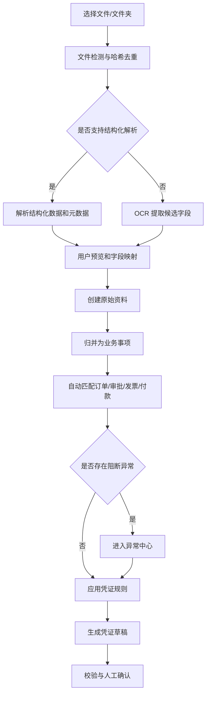
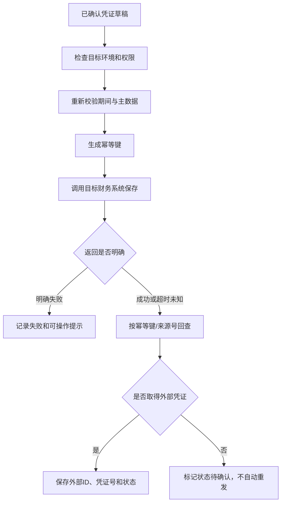

# Auto Voucher 产品需求文档（PRD）

> 文档版本：v0.3
> 文档状态：P0 功能闭环已完成；P1 适配器实现完成；部分 P2 只读查询与 OFD/XBRL 已实现；真实环境验收待外部账号
> 更新日期：2026-07-24
> 产品形态：本地优先的凭证自动化程序
> 关联文档：[凭证自动化本地化程序调研与实现方案](../docs/凭证自动化本地化程序调研与实现方案.md)

## 1. 产品概述

### 1.1 一句话定义

Auto Voucher 是一款在企业本地运行的凭证自动化工具，帮助财务人员读取业务资料、匹配单据、生成可审核的凭证草稿、推送财务系统，并统一查询凭证、账簿和报表。

### 1.2 用户问题

企业的凭证资料通常分散在 Excel、审批系统、业务系统、发票文件、银行流水和财务软件中。财务人员需要重复完成：

- 下载、整理和重命名不同来源的文件；
- 核对订单、审批、发票、收付款是否一致；
- 查找会计科目、部门、项目、供应商等核算信息；
- 手工录入凭证并检查借贷平衡；
- 到财务系统中查询凭证是否保存成功；
- 在多个系统之间查找凭证、明细账和报表；
- 处理重复发票、金额不一致、科目不确定等异常。

这些工作重复、耗时、容易漏项，且错误往往到月末对账时才暴露。

### 1.3 产品价值

Auto Voucher 把凭证处理变成一条可重复、可审核、可追溯的流程：

```text
导入业务资料
→ 自动结构化和匹配
→ 生成凭证草稿
→ 集中处理异常
→ 人工确认
→ 推送或导出
→ 回查凭证号
→ 查询和追溯
```

产品不以“替代会计”为目标，而是减少重复整理和录入，把判断不明确的事项明确交给财务人员处理。

## 2. PRD 前提与待确认项

由于尚未指定首个客户、业务场景和财务软件，本版 PRD 使用以下默认前提：

| 项目 | 当前假设 | 确认后可能产生的变化 |
|---|---|---|
| 首要用户 | 中小企业财务会计、总账会计 | 页面权限、审核流程 |
| 使用频率 | 日常导入，每周/月末集中处理 | 批处理容量和提醒策略 |
| 部署方式 | 单机本地应用，默认仅本机访问 | 多人版需登录、RBAC、PostgreSQL |
| 首个验收场景 | 采购付款 | 字段、匹配和凭证模板 |
| 首版数据入口 | Excel/CSV、数电发票 XML、PDF/图片、银行流水文件 | 解析器优先级 |
| 首版推送边界 | 导出凭证模板；确定目标系统后增加“保存草稿”API | 适配器和验收环境 |
| 自动化边界 | 自动生成草稿，人工确认后推送 | 是否允许规则自动批准 |
| 财务系统 | 首个适配器实现选择金蝶云·星空 WebAPI v6 | 真实产品版本、字段和测试账套仍需验收 |
| 流程系统 | 首个适配器实现选择飞书审批 v4 | 真实审批定义、字段和租户授权仍需验收 |
| 会计规则 | 客户提供科目表和映射规则 | 凭证生成逻辑 |

这些假设用于先形成可评审方案，不代表用户已经确认。

## 3. 产品目标

### 3.1 业务目标

1. 把分散资料整理、单据匹配、凭证录入和结果回查整合为一条流程。
2. 减少正确且规则明确的业务事项所需的手工录入。
3. 在凭证推送前发现重复、金额差异、缺失资料和核算信息错误。
4. 建立原始资料、业务事项、本地凭证草稿和外部凭证之间的可追溯关系。
5. 通过适配器逐步兼容中国企业常用的流程、业务、银行和财务系统。

### 3.2 用户目标

- 用户不需要理解 API、MCP、JSON 或数据库即可完成日常操作。
- 用户能够看懂系统为什么生成某条分录。
- 用户能够快速定位需要人工判断的异常。
- 用户能清楚区分“已生成”“已确认”“已推送”和“已在财务系统回查成功”。
- 用户能够从凭证反查原始资料，也能从原始资料查到对应凭证。

### 3.3 非目标

首版不追求：

- 替代财务软件成为法定总账系统；
- 自动审核、自动过账或自动结账；
- 覆盖所有行业和所有会计事项；
- 同时接入所有中国 OA、ERP、银行和财务软件；
- 自行完成税务申报；
- 根据一张票据无条件猜测完整会计处理；
- 直接写入财务系统数据库；
- 多租户公有云 SaaS；
- 移动端应用。

## 4. 用户与角色

### 4.1 核心用户

#### 财务会计

- 导入业务数据和票据；
- 查看匹配结果；
- 补充科目和辅助核算；
- 处理异常；
- 生成和修改凭证草稿。

#### 复核/总账会计

- 检查来源证据和凭证分录；
- 批准或退回凭证草稿；
- 推送到财务系统；
- 查看推送和回查结果。

#### 财务管理员

- 设置公司、账簿、会计期间和凭证字；
- 导入科目、供应商、客户、部门、项目等基础资料；
- 配置凭证规则和连接器；
- 管理备份与恢复。

#### 审计/管理人员

- 只读查询原始资料、凭证、处理记录和报表；
- 查看人工修改和推送日志；
- 导出审计资料。

### 4.2 MVP 角色处理

单机 MVP 暂不要求登录系统，但仍必须记录每次“确认”和“推送”的操作者名称。首次启动时要求用户设置本机操作者；多人版再启用正式角色和权限。

## 5. 核心用户故事

### US-001：批量导入资料

作为财务会计，我希望把一个月的业务表、发票和银行流水一次拖入程序，以便系统自动识别和整理，而不是逐个复制粘贴。

### US-002：查看单据匹配

作为财务会计，我希望看到采购订单、审批、收货、发票和付款之间的对应关系，以便快速发现缺件和金额差异。

### US-003：生成凭证草稿

作为财务会计，我希望系统根据公司规则生成借贷平衡的凭证草稿，以便减少手工录入。

### US-004：集中处理异常

作为财务会计，我希望只处理重复票据、金额不一致、科目不确定和辅助核算缺失等事项，以便把时间用在真正需要判断的地方。

### US-005：解释分录

作为复核会计，我希望每条凭证分录都能显示来源资料和命中规则，以便我判断凭证是否正确。

### US-006：安全推送

作为复核会计，我希望确认凭证后将其保存到目标财务系统，并自动回查凭证号，以便确认没有漏传或重复。

### US-007：查询和追溯

作为审计人员，我希望从一张凭证查看全部来源文件、规则和操作记录，也能从原始单据查到凭证，以便审计和问题定位。

### US-008：复用已确认规则

作为财务管理员，我希望把一次人工修正保存为企业规则，以便以后相同业务自动使用正确科目和核算维度。

## 6. 产品范围与版本规划

### 6.1 P0：本地文件闭环

P0 是第一个可运行版本，不依赖第三方 API 权限。

必须包含：

- 本地启动和数据目录设置；
- Excel/CSV 业务数据导入；
- 数电发票 XML 导入；
- PDF/图片上传及 OCR 候选提取；
- 银行流水 Excel/CSV 导入；
- 原始文件归档和哈希去重；
- 采购付款预设场景；
- 业务资料自动匹配；
- 科目和辅助核算规则；
- 凭证草稿生成、编辑、校验和人工确认；
- 异常中心；
- 通用凭证 Excel 导出；
- 本地资料、草稿和处理记录查询；
- 示例公司和虚构测试数据；
- 本地备份与恢复。

当前实现进度（2026-07-24）：

- 已完成：SQLite 本地持久化、SHA-256 原件归档、CSV/XLSX/XML 导入、未知表格字段映射及模板复用、本地 OCR 候选与人工确认、资料归并和占用保护、结构化规则优先级、凭证草稿及分录编辑、异常处理、人工/批量确认、通用 XLSX 导出、本地查询、演示推送状态机、操作系统密钥库接口、日志脱敏、完整性校验 ZIP 备份恢复。
- 已完成的扩展能力：规则冲突解释与版本管理、批量生成逐项持久化、后台同步、OFD/XBRL 结构化读取边界、审计日志服务端只追加、源系统原始响应归档，以及按金蝶连接器能力启用的外部凭证、账簿和三大财务报表只读查询。
- 部分完成：XML 已支持通用字段映射，仍需真实数电发票样本扩充；文本型 PDF 已提取文本但尚未提供与图片 OCR 相同的字段确认表单；本地账簿是已确认凭证汇总，不是法定总账报表；Windows 安装包已有自动构建配置但尚未在真实 Windows 环境安装验收。
- 已实现但未完成外部验收：飞书审批增量同步、金蝶主数据/期间查询、金蝶凭证草稿保存与回查、环境锁、预检和厂商错误映射均已进入代码与模拟合同测试；仍需真实产品版本、测试租户/账套、授权范围和脱敏样本。

### 6.2 P1：一个流程系统和一个财务系统

必须包含：

- 一个流程适配器：飞书或钉钉；
- 一个财务适配器：用友 U8 或金蝶云·星空；
- 审批通过数据增量同步；
- 目标系统主数据同步；
- 凭证草稿保存；
- 推送幂等；
- 推送后回查凭证 ID、编号和状态；
- 测试/生产环境隔离；
- 连接测试和错误诊断。

适配器协议实现可先完成；只有在确定具体产品版本、测试租户/账套和授权范围并完成真实 API 回读后，才能标记为“真实连接成功”或通过 P1 发布门槛。

### 6.3 P2：查询和更多数据源

- 外部凭证统一查询；
- 科目余额、总账、明细账、辅助账查询；
- 资产负债表、利润表、现金流量表查询；
- OFD、XBRL 和更多电子凭证；
- 银行电子回单和对账单结构化处理；
- 第二套流程或财务适配器；
- 定时同步和文件夹监听。

### 6.4 P3：企业级版本

- 内网多人部署；
- 用户、角色、SSO 和职责分离；
- 双人复核；
- PostgreSQL 和集中备份；
- 银企直联、税务票夹、费控和商旅接口；
- 电子会计档案移交包；
- 信创环境和国密专项适配。

## 7. 信息架构与页面

### 7.1 导航结构

```text
工作台
导入数据
业务事项
凭证草稿
异常中心
查询中心
规则管理
连接器
设置与备份
```

### 7.2 工作台

展示：

- 本期已导入资料数量；
- 待匹配事项；
- 待补充资料事项；
- 待审核凭证；
- 推送中/状态待确认；
- 推送失败；
- 本期已完成凭证；
- 最近处理记录。

工作台数字必须可点击并进入对应筛选结果。

### 7.3 导入数据

包含：

- 拖拽上传区域；
- 选择文件/文件夹；
- 文件类型提示；
- 导入模板下载；
- 本次导入预览；
- 字段映射；
- 导入进度；
- 成功、重复、失败统计；
- 错误明细下载。

### 7.4 业务事项

列表字段：

- 事项编号；
- 业务类型；
- 公司/账簿；
- 业务日期；
- 供应商/客户/员工；
- 金额和币种；
- 已匹配资料；
- 审批状态；
- 异常数量；
- 凭证状态。

详情页采用“资料关系 + 时间线”展示订单、审批、收货、发票、付款和凭证之间的关系。

### 7.5 凭证草稿

采用左右对照：

- 左侧：原始资料、匹配关系、附件和异常；
- 右侧：凭证头、分录、辅助核算和校验结果。

每条分录显示：

- 科目和名称；
- 借方/贷方金额；
- 部门、项目、成本中心、客商等辅助核算；
- 来源字段；
- 命中规则；
- 是否被人工修改。

支持：

- 单条编辑；
- 批量确认；
- 退回业务事项；
- 保存修改为规则；
- 查看修改前后差异；
- 导出或推送。

### 7.6 异常中心

异常分组：

- 重复资料；
- 金额不一致；
- 缺少资料；
- 科目不确定；
- 辅助核算缺失；
- 会计期间不可用；
- 审批状态不允许；
- 推送失败；
- 外部状态待确认。

异常必须给出：

- 发生了什么；
- 涉及哪些资料；
- 为什么系统不能自动处理；
- 推荐操作；
- 用户可选择的解决方式。

### 7.7 查询中心

P0 支持：

- 原始资料；
- 业务事项；
- 本地凭证草稿；
- 导出和推送记录；
- 操作日志。

P1/P2 按连接器能力支持：

- 外部凭证；
- 科目余额；
- 总账、明细账、辅助账；
- 财务报表。

查询结果必须显示数据来源和最后同步时间，不能把本地缓存冒充目标系统实时结果。

### 7.8 规则管理

规则类型：

- 业务类型 → 凭证模板；
- 供应商/客户 → 默认科目；
- 费用类型 → 费用科目；
- 税率/发票类型 → 税额处理；
- 部门/员工 → 成本中心；
- 项目/订单 → 项目辅助核算；
- 银行账号 → 银行科目；
- 摘要模板；
- 批量确认适用条件。

规则具有：

- 名称；
- 优先级；
- 适用公司和业务类型；
- 条件；
- 动作；
- 生效日期；
- 版本；
- 启用状态；
- 创建人和修改记录。

## 8. 核心业务流程

### 8.1 导入到凭证



### 8.2 推送与回查



### 8.3 状态定义

业务事项状态：

```text
已导入 → 待匹配 → 待补充/可生成 → 已生成 → 已完成
```

凭证草稿状态：

```text
已生成 → 待审核 → 已确认 → 推送中 → 状态待确认 → 已推送
                                      ↘ 推送失败
```

状态只能通过明确事件迁移，禁止仅通过页面刷新推断状态。

## 9. 功能需求（EARS）

优先级说明：

- P0：首个本地闭环必须完成；
- P1：首个真实系统集成必须完成；
- P2：后续查询和扩展能力。

### 9.1 导入与归档

**FR-IMP-001（P0）：文件导入**
当用户选择文件或文件夹时，系统应识别支持的文件，并在正式导入前显示文件数量、类型和预计处理方式。

**FR-IMP-002（P0）：支持格式**
系统应支持 Excel、CSV、XML、PDF、PNG 和 JPEG 文件导入。

**FR-IMP-003（P0）：结构化优先**
当文件包含可读取的结构化数据时，系统应优先解析结构化字段和元数据，不得仅保留 OCR 文本。

**FR-IMP-004（P0）：哈希去重**
当文件内容哈希已存在时，系统应标记为重复并禁止静默创建第二份原始资料。

**FR-IMP-005（P0）：字段映射**
当首次导入未知 Excel/CSV 模板时，系统应允许用户把源列映射到标准字段，并保存为可复用模板。

**FR-IMP-006（P0）：导入预览**
当系统完成解析时，系统应在写入业务数据前显示抽样预览、字段错误和缺失项。

**FR-IMP-007（P0）：部分失败**
当批量文件中部分文件解析失败时，系统应继续处理其他文件，并分别报告成功、重复和失败结果。

**FR-IMP-008（P0）：原件归档**
当文件导入成功时，系统应保留原文件、哈希、来源、导入时间和解析结果，并禁止无痕覆盖。

**FR-IMP-009（P0）：OCR 边界**
当 PDF 或图片没有结构化数据时，系统应把 OCR 字段标记为候选值，并对低置信度关键字段要求人工确认。

**FR-IMP-010（P1）：连接器同步**
当用户运行已配置的数据源同步时，系统应按上次成功游标增量拉取数据，并保留源系统原始响应。

### 9.2 业务事项与匹配

**FR-MAT-001（P0）：业务事项创建**
当导入资料包含可识别业务记录时，系统应按业务唯一标识、主体和业务类型创建或更新业务事项。

**FR-MAT-002（P0）：资料关联**
当订单号、审批单号、发票号、流水号或其他关联字段匹配时，系统应建立资料之间的可追溯关系。

**FR-MAT-003（P0）：金额匹配**
当多个资料关联到同一事项时，系统应比较含税金额、不含税金额、税额和付款金额，并展示差异。

**FR-MAT-004（P0）：拆合单**
当存在一对多或多对一关系时，系统应允许用户确认拆单、合单或部分付款关系，不得强制一对一匹配。

**FR-MAT-005（P0）：占用保护**
当一张发票或一笔银行流水已被有效业务事项使用时，系统应阻止其被另一事项重复使用，除非用户明确执行拆分。

**FR-MAT-006（P0）：匹配解释**
当系统自动建立关联时，系统应显示使用的字段、规则和匹配置信度。

**FR-MAT-007（P0）：阻断异常**
当存在金额不一致、重复资料、主体冲突或关键资料缺失时，系统应把事项标记为待处理，并阻止凭证进入可确认状态。

**FR-MAT-008（P1）：审批门槛**
在审批状态控制已启用时，只有源系统明确返回审批通过的事项才可进入可推送状态。

### 9.3 凭证规则与生成

**FR-VCH-001（P0）：生成草稿**
当业务事项满足凭证模板条件时，系统应根据当前有效规则生成凭证头和分录草稿。

**FR-VCH-002（P0）：金额精度**
系统应使用十进制定点金额计算，并按币种和企业精度规则进行舍入。

**FR-VCH-003（P0）：借贷平衡**
系统应确保每张可确认凭证的借方合计等于贷方合计。

**FR-VCH-004（P0）：单边金额**
系统应确保每条分录不能同时包含非零借方和非零贷方。

**FR-VCH-005（P0）：辅助核算**
当科目要求辅助核算时，系统应校验部门、项目、成本中心、客户、供应商或员工等必填维度。

**FR-VCH-006（P0）：规则优先级**
当多条规则同时命中时，系统应按明确优先级选择，并展示冲突和最终选择。

**FR-VCH-007（P0）：分录解释**
系统应为每条自动生成的分录记录来源资料、来源字段、规则版本和生成说明。

**FR-VCH-008（P0）：人工编辑**
当用户修改凭证草稿时，系统应记录修改前后值、操作者、时间和原因。

**FR-VCH-009（P0）：保存为规则**
当用户完成一次人工修改时，系统应允许其选择“仅本次使用”或创建一条待启用的新规则。

**FR-VCH-010（P0）：AI 建议边界**
当系统使用 AI 推荐科目或核算维度时，系统应标记其为建议、显示置信度，并始终要求人工确认后才能推送。

**FR-VCH-011（P0）：禁止猜测关键金额**
当关键金额、税号、银行账号或主体缺失时，系统不得通过 AI 自动补造确定值。

### 9.4 审核与异常

**FR-REV-001（P0）：审核对照**
当用户打开凭证草稿时，系统应同时展示来源资料、匹配关系、凭证分录和校验结果。

**FR-REV-002（P0）：确认门槛**
当凭证存在阻断异常、借贷不平或必填辅助核算缺失时，系统应禁止确认。

**FR-REV-003（P0）：批量确认**
当多张凭证无阻断异常且规则一致时，系统应允许用户批量确认，并在执行前显示数量和金额汇总。

**FR-REV-004（P0）：退回处理**
当用户退回凭证草稿时，系统应要求填写原因，并把相关业务事项恢复到可处理状态。

**FR-REV-005（P0）：异常解决**
当用户解决异常时，系统应记录选择的解决方式、关联资料变化和凭证重新生成结果。

**FR-REV-006（P0）：已确认后修改**
当用户修改已确认但未推送的凭证时，系统应撤销确认状态并要求重新确认。

### 9.5 导出、推送与回查

**FR-PSH-001（P0）：模板导出**
当用户导出已确认凭证时，系统应按选定模板生成包含凭证头、分录和辅助核算的 Excel 文件。

**FR-PSH-002（P0）：导出追踪**
当导出完成时，系统应记录导出模板、文件哈希、操作者、时间和包含的凭证。

**FR-PSH-003（P1）：环境标识**
在财务连接器启用时，系统应持续显示当前目标是测试环境还是生产环境。

**FR-PSH-004（P1）：推送权限**
当用户尝试推送凭证时，系统应验证凭证已确认、连接器可用、操作权限有效且目标环境明确。

**FR-PSH-005（P1）：推送前校验**
当推送开始时，系统应重新检查会计期间、科目和辅助核算主数据。

**FR-PSH-006（P1）：幂等键**
当系统向目标财务系统保存凭证时，系统应为业务事项、目标账套和凭证版本生成稳定幂等键。

**FR-PSH-007（P1）：回查确认**
当目标系统返回成功或出现结果不明确的超时时，系统应回查目标系统，只有取得外部凭证 ID 和状态后才能标记为已推送。

**FR-PSH-008（P1）：未知状态**
当推送结果不明确且回查未找到凭证时，系统应标记为“状态待确认”，并禁止自动重发。

**FR-PSH-009（P1）：能力控制**
在连接器不支持提交、审核或过账时，系统不得显示或调用对应操作。

**FR-PSH-010（P1）：默认保存草稿**
除非管理员明确启用更高操作级别，系统应只调用目标财务系统的保存草稿能力。

**FR-PSH-011（P1）：禁止直接写库**
系统不得通过直接写入目标财务系统数据库的方式创建、修改或审核凭证。

### 9.6 查询与追溯

**FR-QRY-001（P0）：本地查询**
系统应支持按日期、主体、客商、金额、发票号、流水号、事项号、凭证状态和异常状态查询本地数据。

**FR-QRY-002（P0）：双向追溯**
当用户查看原始资料、业务事项或凭证时，系统应提供相互之间的双向链接。

**FR-QRY-003（P0）：操作时间线**
系统应按时间顺序展示导入、匹配、生成、修改、确认、导出、推送和回查记录。

**FR-QRY-004（P1）：外部凭证查询**
在连接器支持外部凭证查询时，系统应显示外部凭证 ID、编号、状态、最后回查时间和数据来源。

**FR-QRY-005（P2）：账簿查询**
在连接器支持账簿查询时，系统应允许按账簿、期间、科目和辅助维度查询余额和明细。

**FR-QRY-006（P2）：报表查询**
在连接器支持报表查询时，系统应提供资产负债表、利润表和现金流量表，并显示口径、来源和同步时间。

**FR-QRY-007（P2）：缓存提示**
当展示的是缓存数据而非实时目标系统数据时，系统应明确标注缓存时间，不得显示为实时结果。

### 9.7 配置、审计和备份

**FR-CFG-001（P0）：基础资料导入**
系统应支持导入科目、供应商、客户、部门、项目、成本中心、银行账号和凭证字等基础资料。

**FR-CFG-002（P0）：规则版本**
当规则被修改时，系统应创建新版本，并保持历史凭证对旧版本的引用。

**FR-CFG-003（P0）：操作者设置**
在单机版首次启动时，系统应要求设置操作者名称，并在确认、导出和推送时记录操作者。

**FR-CFG-004（P0）：敏感信息**
系统应把 API 密钥、访问令牌和证书密码存储在操作系统密钥库，而不是业务数据库或明文配置文件。

**FR-CFG-005（P0）：日志脱敏**
系统应在日志中隐藏密钥、令牌、完整银行账号、身份证号和其他配置的敏感字段。

**FR-CFG-006（P0）：备份**
当用户执行备份时，系统应生成包含数据库、规则、配置元数据和原始文件的可恢复备份包，但不得导出明文密钥。

**FR-CFG-007（P0）：恢复验证**
当用户选择备份包恢复时，系统应在覆盖现有数据前验证包完整性并显示恢复范围。

**FR-CFG-008（P1）：连接测试**
当管理员保存连接器配置时，系统应执行身份、权限、账套、能力和时间连通性测试，并逐项报告结果。

**FR-CFG-009（P0）：诊断日志**
当应用、导入、后台任务、连接器或页面发生故障时，系统应写入结构化诊断日志，包含稳定事件代码、面向用户的说明、建议操作、支持编号、耗时、应用版本和脱敏技术上下文。

**FR-CFG-010（P0）：日志复制与筛选**
当财务人员排查问题时，系统应允许其按级别、模块、时间、关键词和支持编号查询日志，并复制单条或当前页的可读文本。

**FR-CFG-011（P0）：脱敏诊断包**
当用户导出诊断包时，系统应允许选择时间范围，生成带完整性清单和支持编号的 ZIP；不得包含原始票据、凭证分录、数据库、密钥、令牌或完整账号。

**FR-CFG-012（P0）：日志保留**
系统应提供独立于财务审计日志的诊断日志保留策略，自动按天数和最大条数清理；该策略不得删除或修改财务审计记录。

## 10. 业务规则

### BR-001：唯一性

原始资料使用“来源系统 + 外部 ID”和“内容 SHA-256”共同去重。文件名、金额或发票号码不能单独作为唯一依据。

### BR-002：金额

- 金额使用 Decimal；
- 每条分录只能有借方或贷方；
- 凭证借贷必须平衡；
- 舍入差异必须进入明确的舍入规则或异常，不得静默调整。

### BR-003：资料占用

- 一张发票默认只能被一个有效业务事项完整使用；
- 一笔流水默认只能被一个有效业务事项完整使用；
- 部分使用必须记录拆分金额，所有拆分合计不得超过原金额。

### BR-004：审批

启用审批控制后，审批中、撤回、拒绝或未知状态的业务事项不能推送。

### BR-005：规则顺序

```text
企业明确规则
> 已确认历史映射
> 客商默认规则
> 关键词/票据类型规则
> AI 推荐
> 人工选择
```

### BR-006：推送完成

只有目标财务系统回查返回外部凭证 ID 和明确状态，才可标记为“已推送”。HTTP 200、SDK 无异常或请求已发送都不单独代表推送完成。

### BR-007：已推送凭证

首版不允许在本程序中直接修改已推送凭证。需要更正时，应在目标财务系统按其规则冲销或新增更正凭证，再同步状态。

### BR-008：正式报表

财务系统已接入时，正式账簿和报表以财务系统回查结果为准。本地草稿汇总只能标记为“预估/本地数据”。

## 11. 非功能需求

### 11.1 性能

- **NFR-PERF-001**：系统应在普通办公电脑上完成 10,000 行标准 Excel/CSV 的导入预览，目标时间不超过 60 秒。
- **NFR-PERF-002**：系统应把超过 3 秒的导入、OCR、生成、导出和同步任务作为后台任务执行，并显示进度。
- **NFR-PERF-003**：本地列表在 100,000 条记录规模下，常用筛选的目标响应时间不超过 2 秒。
- **NFR-PERF-004**：批量生成凭证时，系统应持续保存进度，程序重启后不得从头重复已完成项。

### 11.2 数据正确性与可靠性

- **NFR-REL-001**：所有金额计算必须使用十进制定点数。
- **NFR-REL-002**：系统不得因单个文件、单条记录或单张凭证失败而丢失整批结果。
- **NFR-REL-003**：系统应保证重复点击、程序重启和网络重试不会生成重复外部凭证。
- **NFR-REL-004**：系统应在每次状态变更后持久化，不依赖内存保存关键状态。
- **NFR-REL-005**：系统应提供备份完整性校验和恢复结果报告。

### 11.3 安全与隐私

- **NFR-SEC-001**：程序默认只监听 `127.0.0.1`。
- **NFR-SEC-002**：原始财务资料默认仅在本地处理和保存。
- **NFR-SEC-003**：调用云端 OCR 或模型前，系统必须显示将上传的数据范围并取得明确授权。
- **NFR-SEC-004**：密钥必须存储在操作系统密钥库。
- **NFR-SEC-005**：日志、错误报告和导出诊断包必须脱敏。
- **NFR-SEC-006**：生产连接器必须使用最小权限账号，并禁止复用个人管理员账号作为默认配置。

### 11.4 可审计性

- **NFR-AUD-001**：系统应保留原始资料哈希、解析结果、规则版本、人工修改、确认、导出、推送请求摘要和回查结果。
- **NFR-AUD-002**：审计日志应只追加，普通用户不得编辑。
- **NFR-AUD-003**：任何页面显示的外部状态都应带最后验证时间。
- **NFR-AUD-004**：每个本地接口请求、后台任务和诊断包应使用可搜索的关联编号串联相关诊断记录。
- **NFR-AUD-005**：诊断日志应在写入前递归脱敏，导出包只包含最小必要的环境和状态摘要。

### 11.5 易用性

- **NFR-UX-001**：非技术用户完成首次示例导入到凭证草稿，目标时间不超过 10 分钟。
- **NFR-UX-002**：用户不需要编辑 JSON、运行命令行或手工配置数据库。
- **NFR-UX-003**：每个异常必须给出具体原因和下一步操作，不使用纯错误码作为用户提示。
- **NFR-UX-004**：测试环境和生产环境必须使用持续可见且不同的视觉标识。

## 12. 成功指标

以下为试点目标，需在取得真实样本后校准：

| 指标 | P0/P1 目标 | 统计方式 |
|---|---:|---|
| 标准模板导入成功率 | ≥ 99% | 成功记录 / 合法记录 |
| 借贷不平凭证进入可确认状态 | 0 | 阻断校验 |
| 同一业务事项重复推送 | 0 | 本地幂等和外部回查 |
| 完整规则覆盖事项自动生成草稿比例 | ≥ 80% | 无需补字段的草稿 / 符合预设场景事项 |
| 简单凭证人工复核中位时间 | ≤ 30 秒/张 | 从打开到确认 |
| 推送结果错误标记为成功 | 0 | 推送日志与目标账套核对 |
| 原始资料到凭证可追溯率 | 100% | 抽样审计 |
| P0 示例首次成功时间 | ≤ 10 分钟 | 新用户测试 |

不把“AI 推荐准确率”作为唯一产品成功指标。更重要的是阻断错误、减少录入和保持可追溯。

## 13. 验收标准（Given / When / Then）

### AC-001：成功导入标准业务文件

Given 用户选择符合标准模板的采购订单、发票和银行流水
When 用户确认导入
Then 系统创建对应原始资料和业务记录
And 显示成功、重复和失败统计
And 原文件和哈希可在详情页查看。

### AC-002：重复文件不会重复入账

Given 一个文件已经成功导入
When 用户再次导入内容完全相同但文件名不同的文件
Then 系统把该文件标记为重复
And 不创建第二份有效原始资料
And 显示已有记录链接。

### AC-003：部分失败不影响整批

Given 一批文件中包含合法 Excel、损坏 PDF 和重复发票
When 用户执行导入
Then 合法文件成功导入
And 损坏文件进入失败列表
And 重复发票进入异常列表
And 用户可以下载错误明细。

### AC-004：完整采购付款生成凭证

Given 采购订单、收货、发票和付款金额一致且规则完整
When 系统运行凭证生成
Then 生成借贷平衡的凭证草稿
And 每条分录显示来源和命中规则
And 草稿可以进入待审核状态。

### AC-005：金额不一致被阻断

Given 发票金额为 10,000 元而审批金额为 9,000 元
When 系统匹配资料
Then 创建金额不一致异常
And 显示 1,000 元差异
And 在异常解决前禁止确认对应凭证。

### AC-006：重复发票被阻断

Given 同一销售方税号和发票号码已经关联到有效事项
When 新事项再次使用该发票
Then 系统创建重复发票异常
And 显示原事项链接
And 不自动生成可确认凭证。

### AC-007：缺少辅助核算被阻断

Given 费用科目要求项目辅助核算
And 当前业务事项没有项目
When 系统校验凭证
Then 项目字段显示为必填错误
And 凭证不能确认
And 用户补充项目后可以重新校验。

### AC-008：人工修改可追溯

Given 用户把科目从 660201 修改为 660202
When 用户保存草稿
Then 系统记录修改前后值、用户、时间和原因
And 用户可以选择是否保存为新规则。

### AC-009：已确认凭证修改后重新审核

Given 凭证草稿已经确认但尚未推送
When 用户修改金额、科目或辅助核算
Then 系统把状态恢复为待审核
And 禁止在重新确认前导出或推送。

### AC-010：成功导出

Given 一组凭证已经确认
When 用户选择通用 Excel 模板导出
Then 系统生成可下载文件
And 文件包含凭证头、分录和辅助核算
And 导出记录可以反查所含凭证。

### AC-011：推送成功必须回查

Given 已确认凭证和可用的测试财务连接器
When 用户执行推送
Then 系统保存凭证并执行回查
And 只有回查取得外部凭证 ID 和状态后才显示已推送
And 详情页显示外部凭证号和最后回查时间。

### AC-012：超时不自动重发

Given 目标系统在保存请求后发生网络超时
When 系统无法立即确认保存结果
Then 系统先按幂等键或来源号回查
And 未查到结果时标记状态待确认
And 不自动再次调用保存。

### AC-013：已结账期间禁止推送

Given 目标财务系统返回凭证期间已结账
When 用户尝试推送
Then 系统停止推送
And 显示期间已结账及目标期间
And 不修改本地凭证为已推送。

### AC-014：双向追溯

Given 一张已经导出或推送的凭证
When 用户打开凭证详情
Then 用户可以打开关联订单、审批、发票和流水
And 从任一来源资料可以返回该凭证。

### AC-015：备份可恢复

Given 用户生成了完整备份包
When 在干净测试数据目录执行恢复
Then 数据库、规则、原始文件和关联关系被恢复
And 系统报告校验结果
And 不恢复或暴露明文密钥。

## 14. 错误处理

| 错误条件 | 系统处理 | 用户提示 | 是否可重试 |
|---|---|---|---|
| 不支持的文件类型 | 不导入 | “暂不支持该文件类型”并列出支持格式 | 否，需转换 |
| 文件损坏 | 单文件失败，整批继续 | “文件无法读取，请重新导出或更换文件” | 是 |
| 文件重复 | 不创建重复记录 | “内容已导入”，提供已有记录 | 无需 |
| Excel 缺少必填列 | 停止该模板导入 | 显示缺少列和模板下载 | 是 |
| XML/OFD 签名无效 | 保存原件但标记阻断异常 | “电子凭证签名验证未通过” | 需人工处理 |
| OCR 低置信度 | 字段标黄并要求确认 | “请核对识别内容” | 是 |
| 金额不一致 | 创建阻断异常 | 显示各来源金额及差额 | 是 |
| 科目不存在 | 禁止确认 | “科目不存在或已停用” | 是 |
| 辅助核算缺失 | 禁止确认 | 显示缺失维度 | 是 |
| 借贷不平 | 禁止确认 | 显示借贷差额 | 是 |
| 连接器认证失败 | 停止同步/推送 | “认证失败，请检查授权” | 配置后重试 |
| 权限不足 | 停止操作 | 显示缺少的能力/权限 | 授权后重试 |
| API 限流 | 按服务端指示延迟重试 | 显示等待状态 | 自动有限重试 |
| 网络超时 | 进入回查或待确认 | “结果暂不明确，正在核对” | 不直接重发 |
| 会计期间关闭 | 禁止推送 | 显示关闭期间 | 更换期间后重试 |
| 目标系统字段校验失败 | 保存错误详情并回到待处理 | 翻译为业务字段提示，保留原错误码 | 修复后重试 |
| 本地磁盘空间不足 | 停止新写入 | 显示所需空间和数据目录 | 清理后重试 |
| 备份校验失败 | 禁止恢复 | “备份包不完整或已损坏” | 更换备份 |

## 15. 数据与审计要求

### 15.1 核心实体

- 原始资料 `SourceDocument`
- 业务事项 `BusinessEvent`
- 资料关联 `DocumentMatch`
- 异常 `ExceptionCase`
- 凭证草稿 `VoucherDraft`
- 凭证分录 `VoucherLine`
- 规则及版本 `VoucherRule`
- 外部引用 `ExternalReference`
- 推送尝试 `PostingAttempt`
- 同步游标 `SyncCursor`
- 审计事件 `AuditEvent`

### 15.2 数据保留

- 原始资料进入归档后不得静默覆盖；
- 修改形成新版本或新记录；
- 普通用户不得编辑审计日志；
- 删除和保管期限由企业制度决定；
- P0 不提供无审计的批量永久删除；
- 备份必须包含数据库和原始资料；
- 密钥不进入备份包。

## 16. 实现检查清单

### 产品与设计

- [x] 确认首个业务场景和虚构样本文件（采购付款）
- [x] 确认 P0 页面线框图
- [x] 确认异常分类和用户用语
- [x] 确认测试/生产环境视觉规范
- [x] 准备虚构示例公司、科目和业务资料

### 数据与后端

- [x] 建立 SQLite 数据库迁移
- [x] 实现原始资料和文件归档
- [x] 实现 SHA-256 去重
- [x] 实现 Excel/CSV 模板映射
- [x] 实现通用字段型数电发票 XML 解析
- [x] 实现 PDF/图片 OCR 候选提取与图片候选人工确认
- [x] 实现业务事项归并
- [x] 实现资料匹配和占用规则
- [x] 实现整数分金额和凭证模型
- [x] 实现首个确定性采购付款规则及版本记录
- [x] 实现凭证校验器
- [x] 实现异常状态机
- [x] 实现凭证确认和退回
- [x] 实现通用 Excel 导出
- [x] 实现审计日志
- [x] 实现备份、校验和恢复

### 前端

- [x] 工作台
- [x] 导入字段映射编辑器
- [x] 业务事项列表与详情
- [x] 凭证草稿对照编辑
- [x] 异常中心
- [x] 查询中心（本地凭证汇总）
- [x] 规则管理（结构化创建、优先级匹配、启停与版本引用）
- [x] 设置与备份
- [x] 空状态、加载状态和错误状态

### P1 集成

- [ ] 确认首个流程系统、产品版本和测试租户
- [ ] 确认首个财务系统、产品版本和测试账套
- [x] 定义演示、飞书审批和金蝶云·星空连接器能力探测
- [x] 实现演示凭证保存和外部查询状态机
- [x] 实现金蝶主数据与期间查询协议（真实账套验收待完成）
- [x] 实现飞书审批通过实例增量同步协议（真实租户验收待完成）
- [x] 实现金蝶凭证草稿 Save 与 View 回查协议（真实账套验收待完成）
- [x] 实现幂等键和 Outbox
- [x] 实现超时回查
- [x] 验证界面测试/生产环境显式区分、环境锁和生产 HTTPS
- [x] 完成飞书与金蝶错误分类、人工动作提示和未知状态保护

### 测试

- [x] 支持格式、未知字段和损坏结构化文件隔离测试
- [x] 哈希和业务唯一键去重测试
- [x] 多来源归并和人工部分付款/差额拆分测试
- [x] 金额整数分、舍入和借贷平衡测试
- [x] 必填辅助核算测试
- [x] 规则优先级和版本引用测试
- [x] 人工修改审计测试
- [x] 批量导入部分失败测试
- [x] 重复导入、推送幂等和备份恢复后去重测试
- [x] API 超时但远端成功测试
- [x] API 限流、权限和厂商字段错误映射自动化测试
- [x] 真实连接器预检：确认状态、审批、权限能力、环境、期间、目标科目和辅助核算
- [x] 飞书同步字段映射、游标续跑和重复实例去重测试
- [x] 已结账期间测试
- [x] 备份恢复与篡改拒绝测试
- [x] 完整采购付款浏览器 E2E：三资料归并、金额异常、规则生成、确认、推送、查询
- [x] 图片 OCR 浏览器 E2E：候选提取、人工确认、结构化规则生成凭证

## 17. 发布门槛

### P0 发布门槛

- 15 个验收场景中适用于 P0 的场景全部通过；
- 示例采购付款流程可以从文件导入完整跑到凭证导出；
- 重复发票、金额差异和缺辅助核算能够被阻断；
- 借贷不平凭证无法确认；
- 所有原始资料和人工修改可追溯；
- 在干净环境完成一次备份恢复；
- Windows 安装包可由非开发者完成安装和首次示例；
- 不需要命令行、Docker、API Key 或数据库配置。

### P1 发布门槛

- 使用目标厂商测试账套完成创建、超时、限流、权限不足和期间关闭测试；
- 连续重复触发同一业务事项不会生成两张外部凭证；
- 每张已推送凭证都能回查外部 ID、凭证号和状态；
- 测试与生产环境无法误选或静默切换；
- 真实客户脱敏样本完成一轮财务人员验收；
- “测试通过”与“已部署/已发布”分别记录。

## 18. 风险

| 风险 | 影响 | 应对 |
|---|---|---|
| 未确定首个财务系统 | P1 无法进入真实接口开发 | 先完成 P0；尽快确定产品、版本和测试账套 |
| 客户规则不完整 | 自动生成率低 | 提供规则导入、人工修正和版本管理 |
| 样本数据过于理想 | 上线后异常激增 | 验收数据必须包含拆单、重复、差异和缺件 |
| OCR 被误当原始数据 | 产生错误或丢失证据 | 结构化优先；OCR 候选值需确认 |
| 厂商 API 有文档但无权限 | 集成延期 | 项目启动时先做连接与权限 PoC |
| 自动推送权限过大 | 错误进入正式账簿 | 默认只保存草稿；审核/过账不进首版 |
| 网络超时导致重复凭证 | 财务数据错误 | 幂等、Outbox、回查后再重试 |
| 本机磁盘损坏 | 数据丢失 | 自动备份、外部备份目录和恢复演练 |
| 宣传超出能力 | 用户误解和合规风险 | 对外使用“可审核凭证草稿”，不宣传完全无人记账 |

## 19. 待产品负责人确认

以下问题不阻塞 PRD 初稿，但会阻塞对应版本开发：

1. **首个业务场景**：是否确认以“采购付款”为 P0 验收场景？
2. **首个财务系统**：用友 U8、金蝶云·星空、畅捷通，还是其他准确产品和版本？
3. **推送边界**：是否确认首版只“保存凭证草稿”，不自动提交、审核或过账？
4. **首个流程系统**：飞书、钉钉、企业微信、泛微、致远，还是先不接？
5. **目标平台**：Windows 优先还是 Windows/macOS 同时发布？
6. **使用模式**：单机会计使用，还是从首版就需要内网多人协作？
7. **真实格式**：是否可以提供脱敏的业务表、发票、银行流水和凭证导入模板？
8. **科目制度**：首个客户使用的会计准则、科目表和辅助核算维度是什么？
9. **AI 模式**：是否允许可选云端模型，还是必须全程本地？
10. **保管要求**：客户对原始资料、日志和备份的保存年限及删除流程是什么？

## 20. 建议评审结论

建议本轮先确认三项：

1. 产品定位是否接受“自动整理、匹配并生成可审核凭证草稿”，而不是“无人化自动记账”；
2. 是否批准 P0 文件闭环作为第一开发阶段；
3. 首个业务场景和财务系统分别选择什么。

这三项确认后，PRD 可升级为 v1.0，并进一步拆分页面原型、数据字典和 P0 开发任务。
